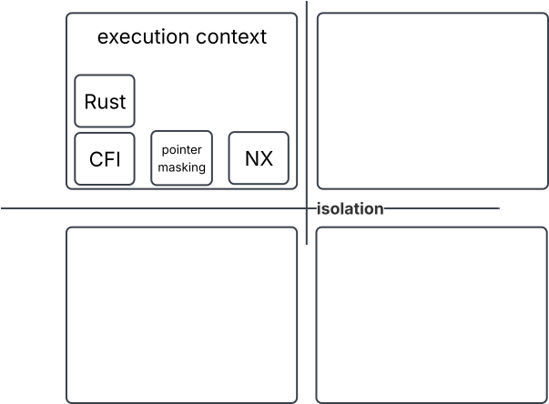
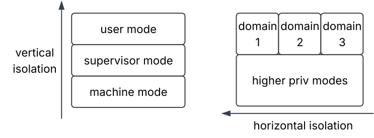
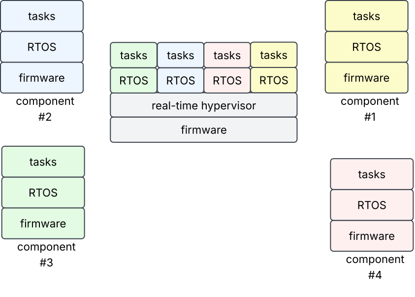
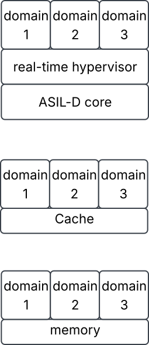

:version: 0.1
:project-name: DMS-1084 Automotive SIG Cybersecurity Section
= {project-name} v{version}
:imagesdir: ./
:toc:
:toclevels: 5
:numbered:
:sectnums:
:sectnumlevels: 5
:xrefstyle: short

[width="100%",cols="25%,75%"]
.Declaration
|===
|Document Declaration |

|Document ID |DMS-1084-Undeclared-CX-CUSD
|Document Control |CONFIDENTIAL
|Associated Program |Undeclared
|Title |Automotive SIG Cybersecurity Section
|Description |This document is the Cybersecurity Section of the Automotive SIG White Paper
|DMS Jira Key |https://sifive.atlassian.net/browse/DMS-1084[DMS-1084]
|Current Version |0.2
|Revision Author |Yann LOISEL
|Revision Date |2-sep-2026
|===

[cols="1,2,3"]
.Version Control
|===
|Rev|Author|Comment

|0.1 |Yann LOISEL|Initial draft
|0.2 |Yann LOISEL|After review/comments from Thomas, Sam and Richard
|===

Revision History

* 0.2
** Update to aligne with Thomas Roecker (Infineon), Sam Visalli (Tenstorrent) and Richard's comments

* 0.1
** Create initial draft

== About this document

=== Purpose and Scope

This document is the cybersecurity section of the RVIA Automotive SIG White Paper.

=== Current status and anticipated changes

Version 0.2 is a draft version.

This version will be pushed as a PR on the RVI github and not be synced anymore with SiFive github

== Cybersecurity Chapter

=== Introduction
The 2015 Jeep hack demonstrated to the world that modern automobiles have evolved far beyond simple mechanical systems of steel and rubber, now incorporating vast networks of electronics and software comparable to PCs or smartphones. Consequently, vehicles face identical security vulnerabilities, which are significantly amplified by their critical role in daily life. This pivotal event sparked numerous global initiatives, leading to the rapid formation of the Auto-ISAC forum in the US and driving extensive regulatory frameworks including UNECE WP29 R155, ISO/SAE 21434, China's GB 44495-2024, and India's AIS-189. Rather than inventing entirely new concepts, these automotive standards adapt well-established security best practices to the unique design constraints, operational demands, and lifecycles characteristic of the automotive sector.

=== Risk Analysis
Conducting a comprehensive risk analysis ensures that system architects prioritize foundational security requirements correctly from the start. By systematically identifying key assets, potential adversary profiles, and realistic attack scenarios, architects can engineer precise countermeasures against relevant threats. A robust security mechanism must not only be implemented correctly (correctness validation) but must also be proven effective at neutralizing the targeted threat vector (efficacy validation).

==== Assets
A rigorous risk analysis begins by mapping out core assets, as these serve as the primary targets for attackers—without defined assets, no security risk exists. In the automotive ecosystem, these assets span a wide spectrum, from user privacy details to OEM intellectual property and national infrastructure. Compromising a single car allows a thief to steal it; breaching hundreds enables criminal organizations to extort an OEM; and exploiting thousands could allow a rogue state to disrupt entire national transit networks. Consequently, assets manifest in diverse forms: the physical safety of drivers and passengers (where a breach could disable critical safety controls), user privacy (encompassing location histories and personally identifiable information), financial stability (affecting owners via disabled features like digital locks, or impacting the reputation and fleet operations of OEMs and suppliers), and operational integrity (affecting core vehicular subsystems). The same asset can attract entirely different attacker profiles depending on their unique motivations.

==== Attacker Profiles
The adversary landscape is diverse, comprising actors with varied objectives, financial resources, and technical sophistication. Opportunistic thieves are primarily focused on vehicle or component theft and operate via close physical proximity. They frequently rely on pre-built hacking tools or exploits developed by more advanced actors, causing localized financial and operational disruption to vehicle owners. Organized crime syndicates possess greater funding and technical capabilities, investing long-term resources into discovering new vulnerabilities, establishing smuggling operations, or reselling exploits for financial gain. Rogue states represent the most sophisticated threat actors; while they may pursue financial objectives similar to organized crime, they also leverage large-scale cyber operations for geopolitical disruption or targeted espionage against specific individuals.

==== Threat Model
Driven by the diversity of assets, varied adversary profiles, and rapid platform digitization, the automotive threat model must encompass remote and local software exploits, physical attacks, and hybrid scenarios. The comprehensive threat portfolio includes, at a minimum, physical eavesdropping, man-in-the-middle attacks, Electromagnetic Analysis (EMA) and Differential Power Analysis (DPA) on cryptographic operations, fault injection, buffer overflows, use-after-free vulnerabilities, code injection, code-reuse attacks, and logical side-channel exploits. The broader security community is tasked with developing robust countermeasures capable of mitigating these diverse attack vectors.

=== Regulation
To guide and enforce industry accountability regarding these cybersecurity challenges, global regulatory frameworks tailored to the automotive landscape have emerged. The most prominent and widely adopted framework is UNECE WP29 R155 (see <<unece-ref>>, a binding regulation enforced across 60 countries—including the EU, the UK, and Japan—since 2022. While technically binding only on OEMs seeking Type Approval, the complex automotive supply chain dictates that compliance is only feasible if suppliers from Tier-1 down to silicon and IP providers participate. Consequently, ISO/SAE 21434:2021 (see <<iso-ref>>) has become a de facto mandatory standard across the entire supply chain.
Adhering to ISO/SAE 21434:2021 not only facilitates UNECE R155 certification for OEMs but also helps them meet regional mandates like China's GB 44495-2024 (see <<gb-ref>>) and India's AIS-189 (see <<ind-ref>>). Embedding these best practices is crucial across a deep supply chain to eliminate vulnerabilities across the entire vehicular lifecycle, spanning development, manufacturing, maintenance, aftermarket upgrades, and Return Merchandise Authorization (RMA).
Furthermore, compliance aids suppliers regarding the European Cyber Resilience Act (CRA); while the CRA exempts finished vehicles, it applies directly to multi-purpose components like automotive chipsets that could also be deployed in industrial applications, smoothing their path to compliance.

=== The Mass Market Challenge
Although the automotive industry operates on a mass-market scale focused heavily on physical safety and mechanical reliability, it must now implement uncompromising cybersecurity solutions. The rise of Software-Defined Vehicles (SDVs)—characterized by an immense volume of interconnected hardware and software components—makes it impossible for OEMs to manage security risks independently. Active collaboration and support from electronics platform suppliers are essential.

=== Electronic Platforms
Security requirements for automotive electronic platforms broadly mirror standard industry best practices and established compliance frameworks, adapted to address unique vehicle vulnerabilities.

Key examples include:

* Given the extended operational lifespans of vehicles, deployed cryptographic systems must incorporate post-quantum resilience.
* Key management architectures must be secure yet highly adaptable to facilitate seamless liability shifts across supply chains, repair facilities, and diagnostic workflows.
* Vehicles frequently operate in unmonitored public spaces, leaving hardware components vulnerable to physical tampering. While SDVs are often described as "data centers on wheels," they lack the protection of secure buildings.

Consequently, standard enterprise security architectures must be integrated via a horizontal approach tailored to this vertical domain. Supplier participation is vital; OEM intervention often occurs too late in the lifecycle to address low-level flaws like micro-architectural hardware bugs. Effective security requires a hybrid approach: hardware provides raw efficiency and performance, while software ensures necessary flexibility.

Electronic platform manufacturers and suppliers are uniquely positioned to implement critical defenses against logical and physical exploits:

* Establishing a Chain of Trust:
Initializing applications from a verified, immutable state is crucial for maintaining systemic integrity. This is achieved by deploying hardware Roots of Trust (RoT), executing secure boot routines, managing authenticated firmware updates, and utilizing cryptographic attestation to verify the active codebase.

* Implementing Flexible Key Management:
Adhering to Kerckhoffs' principle, cryptographic strength must rely entirely on the confidentiality and randomness of keys. Secure factory provisioning at production plants simplifies logistical workflows, ensures rigorous trace quality, and eliminates security gaps before deployment.

* Enforcing the CIA Triad (Confidentiality, Integrity, Availability):
** Confidentiality
Integrating cryptographic extensions, dedicated coprocessors, hardware accelerators, and true random number generators equipped with physical countermeasures (against side-channel, fault, and frequency-injection attacks) empowers platforms to achieve high security. Implementations must support regional cryptographic standards (e.g., US NIST and Chinese GB algorithms) and pass certifications such as NIST CAVP. The RISC-V Cryptographic Vector extensions are key bricks for addressing this requirement.
** Integrity: Deploying hardware mechanisms like parity bits, lockstep logic with real-time comparators, and Error-Correcting Code (ECC) sub-systems. The RISC-V RAS RERI extension helps support this requirement
** Availability: Implementing robust Reliability, Availability, and Serviceability (RAS) architectures.
* Prioritizing Software Security: Software is king !
As codebase sizes grow exponentially, software becomes inherently vulnerable to bugs and exploitable flaws. A foundational step in managing this risk is creating a comprehensive Software Bill of Materials (SBOM) to track components across E/E platforms, helping to audit installed software and quickly address known vulnerabilities.
Software protection strategies depend heavily on codebase modification capabilities, available hardware features, and tradeoffs between performance and cost. The primary attack vector involves breaking memory safety. To counter this, a defense-in-depth approach utilizing multiple overlapping mechanisms is preferred:

** Analysis Tools
Static and dynamic software analysis tools help identify bugs and insecure code patterns during development, assuming the source code can be modified.
** Formal Verification
Mathematical proofs offer ironclad security guarantees but are resource-intensive. Consequently, formal verification is reserved for critical low-level software components, such as secure bootloaders and security-critical OS kernels.
** Modern Programming Languages
Adopting memory-safe languages like Rust inherently prevents entire classes of vulnerabilities, though this requires rewriting existing codebases.
** Memory Tagging
Hardware extensions like pointer masking and memory tagging leverage unused bits in address structures to store metadata, efficiently catching buffer overflows and use-after-free flaws, though with variable performance overhead. RISC-V pointer masking and (soon) memory tagging extensions enable this strategy.
** No-Execute (NX) Attributes
When memory corruption cannot be blocked entirely, configuring vulnerable memory regions as non-executable dramatically limits an attacker's ability to execute injected malicious payloads. RISC-V PMP and RISC-V Worlds extensions offer control of these attributes.
** Control Flow Integrity (CFI)
If code injection is mitigated, adversaries often pivot to Code-Reuse Attacks (CRA) like ROP or JOP, stitching together existing code snippets by manipulating jump and return addresses. Hardware-enforced CFI mitigates this by introducing dedicated landing instructions and label validation while duplicating or cryptographically securing execution stacks. RISC-V CFI extensions (landing pads and shadow stacks) offer robust protection against CRAs at a minimal resource cost for rebuilt software.

* Isolation
Regardless of code quality, execution context isolation is essential for payload containment, ensuring that exploits cannot migrate across systems by splitting software into decoupled compartments. This modularity also enhances the overall software architecture (see <<ContextBd>>).

[[ContextBd]]
.Execution Context

Security isolation utilizes complementary vertical and horizontal strategies. Vertical isolation splits privileges hierarchically, where software at a given privilege level manages the access rules of lower-privilege workloads (e.g., using RISC-V Physical Memory Protection [PMP] in M-mode or SPMP in S-mode). Horizontal isolation establishes standalone, siloed security domains operating via virtualization or process/VM isolation frameworks (see <<IsolationBd>>).

[[IsolationBd]]
.Isolation Categories

The vertical strategy defines resource allocation limits for lower-privilege stacks. Conversely, the horizontal strategy relies on virtualization schemes, such as RISC-V Sv virtual memory frameworks and the “H” hypervisor extension, to silo concurrent environments.

* Integration and Virtualization
To improve efficiency and lower costs, modern automotive platforms consolidate multiple software applications with varying levels of trust onto shared hardware infrastructure. For example, legacy systems running on independent processors are being migrated to execute concurrently on a single core. The underlying hardware must support these mixed-trust binary images without requiring a complete recompilation. While this consolidation affects rich application cores, the greatest advantage occurs within real-time microcontrollers running bare-metal software or thin RTOS environments using physical addressing without a memory management unit (MMU) (see <<VirtualBd>>).

[[VirtualBd]]
.Real-Time Virtualization

Consequently, hardware must support nested physical memory isolation and address translation, which RISC-V implements by (soon) virtualizing SPMP as VSPMP.

* Freedom From Interference (FFI)
This nested isolation is primarily a safety requirement; Freedom From Interference (FFI) dictates that lower-criticality tasks (e.g., ASIL-B) must never compromise high-criticality functions (e.g., ASIL-D). When consolidating multiple ASIL-B and ASIL-D cores onto a single ASIL-D processor, the isolation mechanisms must ensure that safety certifications remain completely valid despite the shared hardware environment.

* Side Channels and Covert Channels
Safety-driven FFI requirements must align with security isolation objectives across all layers, from core micro-architectural components to platform-level blocks like shared caches.

[[FfiBd]]
.Freedom From Interference

Logical side-channel vectors (such as Spectre and Meltdown) should ideally be mitigated directly in hardware to preserve system performance, using ISA-level extensions like RISC-V fence.t or Svukte, or via micro-architectural enhancements below the ISA layer.
At the system layer, Quality of Service (QoS) frameworks—including RISC-V CBQRI/Ssqosid—help mitigate covert channels by managing resource allocation within shared caches. However, because these mechanisms control outgoing transactions from the processor cores, they remain largely core-centric.

* System-Level Isolation
On complex SoCs containing non-core agents like DMAs or GPUs, a lack of matching isolation features can create unauthorized paths to protected system resources. Even core-centric mechanisms require precise system-wide synchronization to remain effective, which is difficult to guarantee in multi-tenant environments with mixed trust tiers. Adversaries do not necessarily need to compromise a system remotely; they may be co-hosted on a less-trusted core. Relying solely on core-centric isolation means that a single bypass can compromise the entire platform. To mitigate this risk, system-level isolation architectures like RISC-V worlds are required to manage resource partitioning and access rights centrally.

* Debug and Trace Security
Hardware debugging, real-time instruction tracing, and precise performance counters are invaluable for profiling software and resolving system anomalies. However, if left unsecured, they become powerful exploitation tools. Unrestricted access to these features can allow attackers to extract sensitive data or hijack execution flows. While disabling these interfaces eliminates the risk, it removes essential engineering diagnostics required throughout the lifecycle, including post-mortem analysis during RMA processes. A superior approach is to gate access via secure credential verification, ensuring trace and debug capabilities are available exclusively within authorized security domains while maintaining strict isolation between tenants.
Physical Security Considerations
As noted in the risk analysis, physical security is an acute concern for the automotive market because vehicles operate in public spaces and undergo maintenance in third-party repair shops. The financial incentives for vehicle owners to bypass monetization features or feature locks can also drive physical tampering. While protecting consumer electronics from physical exploits requires dedicated engineering, non-invasive attacks—such as fault injection—are highly accessible and cost-effective for attackers while yielding high impact. Countering these vectors requires architectural parity with functional safety techniques, including DCLS logic, parity check bits, hardware redundancy, ECC sub-systems, and RAS frameworks.
Physical side-channel analysis targeting secret keys during cryptographic routines represents another critical threat vector. Mitigating these risks requires integrated countermeasures against DPA and EMA, primarily through algorithmic blinding and runtime randomization during cryptographic operations.
Although non-invasive exploits represent the most accessible vector, invasive hardware manipulation must also be considered. While these techniques demand specialized tools, expert knowledge, and capital investment, the potential return on investment for an attacker can be substantial if an exploit discovered during the identification phase can be easily replicated across a fleet during the exploitation phase. Protecting against invasive manipulation requires specialized defensive design structures and rigorous security certifications.

==== Implementation Methodology
Interpreting technical specifications or architectural extensions in isolation often fails to reveal the optimal deployment strategy. Mere literal adherence to documentation is frequently insufficient; achieving robust security requires aligning implementation with the original design philosophy of the authors. This section explores two reference architectures to illustrate the practical application of the aforementioned security mechanisms.

* Entry-Level RVM-Profile Controller: This simplified microcontroller architecture must withstand both logical exploits and physical tampering. For single-agent designs featuring a solitary RISC-V core, isolation relies exclusively on core-centric hardware primitives.
In a restricted software environment (Small-Code Model):

** The system utilizes Machine (M) and User (U) privilege modes, as operating solely in M-mode presents an unacceptable risk profile. Executing the majority of application tasks in U-mode effectively mitigates the danger of privilege escalation during a breach.
** The M-mode environment is reserved for a minimal task scheduler and critical hardware abstraction firmware. Adopting micro-kernel architectures can further reduce this footprint by delegating driver execution to U-mode.
** The M-mode firmware manages Physical Memory Protection (PMP) configurations, ensuring strict isolation between the kernel and tasks, as well as between individual tasks. Smart PMP slot management facilitates highly efficient reconfiguration during context switches.
** Should a U-mode task be compromised, the exploit remains contained, preventing lateral movement to other tasks or elevation to M-mode. This compartmentalization ensures that the broader codebase maintains operational integrity even under active local attack.

In more complex software environments (Large-Code Model):

** A three-tier privilege hierarchy (M, S, and U) is deployed. M-mode handles the primary hardware abstraction layer, Supervisor (S) mode hosts the RTOS kernel, and U-mode executes application tasks. This structure keeps the highly privileged M-mode codebase minimal and less susceptible to flaws, avoiding the excessive risk of a large Trusted Computing Base (TCB) operating at maximum privilege.
** PMP remains under M-mode control to safeguard its own resources from S and U modes, effectively defining the resource boundaries available to lower-privilege software tiers.
** The S-mode RTOS utilizes the Supervisor Physical Memory Protection (SPMP) to isolate kernel memory from U-mode tasks and enforce inter-task boundaries. Crucially, SPMP operates within the overarching constraints established by the M-mode PMP configuration.
** This hierarchical strategy maximizes protection for the most sensitive firmware while maintaining the flexibility and performance required for sophisticated task management in the RTOS.

Complementing this vertical hierarchy, an horizontal isolation strategy can support side-by-side software silos, mirroring traditional REE/TEE architectures. In this configuration, M-mode firmware functions as a secure monitor, utilizing PMP to dynamically manage resource access for each independent silo.
Beyond privilege levels and memory isolation, internal code security is fortified through a defense-in-depth approach, requiring adversaries to bypass multiple distinct security layers:

** Pointer Masking: Current strategies involve tag-based architectures similar to HWASAN, where memory regions are "colored" and validated upon access. The forthcoming memory tagging extension will provide a hardware-native, high-efficiency alternative. Architects must balance the significant security gains of pointer masking against its performance overhead when designing for resource-constrained platforms.
** Memory Access Attributes: Non-executability is enforced through PMP (managed by M-mode) or SPMP (managed by S-mode), allowing administrators to explicitly define Read, Write, and Execute permissions across defined memory ranges.
Control Flow Integrity (CFI): These extensions provide vital defenses when memory corruption cannot be entirely prevented, countering code-reuse attempts:
** CFI landing pads are enabled per privilege level, requiring specific hardware markers for indirect jumps. The impact on binary size and execution speed is minimal and directly scales with the density of jump targets within the code.
CFI shadow stacks offer task-specific protection by maintaining an isolated stack for return addresses. While this adds instructions for stack management, the resulting robustness against return-oriented programming far outweighs the negligible overhead.

* Advanced RVM-Profile Subsystem: This complex processing block, often comprising multiple cores and non-core agents, is typically integrated into larger heterogeneous platforms. Such subsystems may consolidate several entry-level RVM designs to achieve optimal power, performance, and area (PPA) targets.
*** At the core level, real-time virtualization is mandatory to facilitate the seamless deployment of existing binaries. The transition is transparent for software previously utilizing SPMP, which shifts to executing in Virtual Supervisor (VS) mode under VSPMP.
Integrating these subsystems into complex SoCs necessitates robust isolation for both security containment and safety-critical Freedom From Interference (FFI).
Deployment of RISC-V worlds allows the number of security domains to scale precisely with the number of independent execution environments.
*** Utilizing CBQRI/Ssqosid enables system components like shared caches to leverage Resource and Monitoring IDs (RCID/MCID), effectively addressing FFI requirements through managed hardware resource allocation.

=== Conclusion
Cybersecurity challenges in the automotive industry are intensifying rapidly due to the widespread shift toward Software-Defined Vehicles. Leveraging security innovations from adjacent markets—such as the expanding RISC-V ecosystem—enables significant technology reuse. However, because no single security architecture fits all scenarios, success relies on a structured risk analysis methodology to select and implement the most appropriate solutions.

=== Glossary

[cols="1,10", width=80%]

|===
|Term  |Meaning

|ASIL| Automotive Safety Integrity Level
|CRA| Cyber Resilience Act / Code-Reuse Attack
|DCLS| Dual-Core Lock-Step
|EMA| Electromagnetic Analysis
|DPA| Differential Power Analysis
|MMU| Memory Management Unit
|OEM| Original Equipment Manufacturer
|RAS| Reliability, Availability, and Serviceability
|RMA| Return Merchandise Authorization
|SBOM| Software Bill of Materials
|===

[bibliography]
== References

* [[[iso-ref,1]]] https://www.iso.org/standard/70918.html[ISO/SAE 21434:2021 Road vehicles — Cybersecurity engineering]
* [[[unece-ref,2]]] https://unece.org/transport/documents/2021/03/standards/un-regulation-no-155-cyber-security-and-cyber-security[UNECE WP29 R155 Cyber security and cyber security management system]
* [[[gb-ref,3]]] https://www.gov.cn/lianbo/bumen/202409/content_6972669.htm[Chinese National Standard GB 44495-2024]
* [[[ind-ref,4]]] https://hmr.araiindia.com/storage/ais-details/AIS_189_526fd260-4ced-465d-ac8f-a3c9e17a651d.pdf[Indian Automotive Industry Standard AIS 189]
